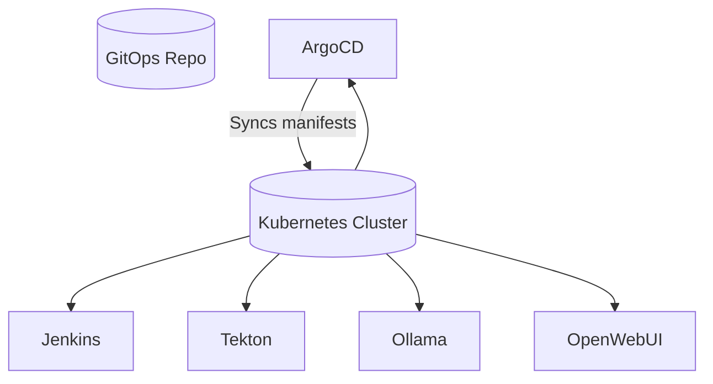

# Backstage Lab 🧪

A GitOps-managed Kubernetes lab for testing Backstage plugins.

Used to test the following [Backstage](https://backstage.io/) plugins:

- [Jenkins](https://github.com/backstage/community-plugins/tree/main/workspaces/jenkins)
- [ArgoCD](https://github.com/backstage/community-plugins/tree/main/workspaces/redhat-argocd)
- [GitHub Actions](https://github.com/backstage/community-plugins/tree/main/workspaces/github-actions)
- [Tekton](https://github.com/backstage/community-plugins/tree/main/workspaces/tekton)
- [MCP Chat](https://github.com/backstage/community-plugins/tree/main/workspaces/mcp-chat)
- [Gitlab](https://github.com/immobiliare/backstage-plugin-gitlab)
- [Multi Source Security Viewer](https://github.com/backstage/community-plugins/tree/main/workspaces/multi-source-security-viewer/plugins/multi-source-security-viewer)

---

## 🧩 Overview

This repository installs and manages the following services through ArgoCD:

- Jenkins
- ArgoCD
- GitHub Workflow
- Tekton Pipelines
- Ollama, Open WebUI, and various LLM models

These manifests run on any Kubernetes cluster with a load balancer.  
I personally use [K3s](https://k3s.io/), but this setup also works with [Minikube](https://minikube.sigs.k8s.io/) or other distros.

---

## 📁 Repository Structure

```bash

├── apps
│   └── applicationset.yaml
├── manifests
│   ├── argocd
│   │   ├── base
│   │   │   ├── argocd-apps.yaml
│   │   │   ├── kustomization.yaml
│   │   │   ├── namespace.yaml
│   │   │   ├── roles.yaml
│   │   │   ├── secrets.yaml
│   │   │   └── service-accounts.yaml
│   │   └── overlays
│   │       └── defaults
│   │           └── kustomization.yaml
│   ├── jenkins
│   │   ├── base
│   │   │   ├── deployment.yaml
│   │   │   ├── kustomization.yaml
│   │   │   ├── namespace.yaml
│   │   │   ├── pvc.yaml
│   │   │   └── service.yaml
│   │   ├── docker
│   │   │   ├── casc
│   │   │   │   ├── base.yaml
│   │   │   │   └── jobs.yml
│   │   │   ├── compose.yml
│   │   │   ├── Dockerfile
│   │   │   └── plugins.txt
│   │   └── overlays
│   │       └── defaults
│   │           └── kustomization.yaml
│   ├── llms
│   │   ├── base
│   │   │   ├── deployment.yaml
│   │   │   ├── kustomization.yaml
│   │   │   ├── namespace.yaml
│   │   │   ├── pvc.yaml
│   │   │   └── service.yaml
│   │   └── overlays
│   │       └── defaults
│   │           └── kustomization.yaml
│   └── tekton
│       ├── base
│       │   ├── kustomization.yaml
│       │   ├── namespace.yaml
│       │   ├── roles.yaml
│       │   ├── secrets.yaml
│       │   ├── service-account.yaml
│       │   └── tekton.yaml
│       └── overlays
│           └── defaults
│               └── kustomization.yaml
├── README.md
└── test-artifacts
    ├── Jenkinsfile
    └── sbom-logs
````

Each service folder contains a base manifest and environment overlays managed by ArgoCD ApplicationSets.

---

## ⚙️ Requirements

### Kubernetes

These manifests are designed for Kubernetes clusters with a LoadBalancer available.

> **Note:**
> If you're using Minikube, you may need to run the [tunnel](https://minikube.sigs.k8s.io/docs/commands/tunnel/) command to expose LoadBalancer services.

### ArgoCD

ArgoCD is used as the GitOps delivery tool.

#### Install ArgoCD

```bash
kubectl create namespace argocd
kubectl apply -n argocd -f https://raw.githubusercontent.com/argoproj/argo-cd/stable/manifests/install.yaml
```

Wait for ArgoCD to finish installing:

```bash
kubectl wait --for=condition=Ready pods --all -n argocd --timeout=300s
```

Expose the ArgoCD server:

```bash
kubectl patch svc argocd-server -n argocd -p '{"spec": {"type": "NodePort"}}'
```

---

#### Get Server URL and Port

> **Note:** Remove the default port at the end of the URL if present.
> The cluster server may not be the first one listed — adjust the `.clusters[index]` value as needed.

```bash
kubectl config view -o jsonpath='{.clusters[0].cluster.server}'
```

```bash
kubectl get svc argocd-server -n argocd -o jsonpath='{.spec.ports[0].nodePort}'
```

---

#### Retrieve ArgoCD Admin Credentials

```bash
kubectl -n argocd get secret argocd-initial-admin-secret -o jsonpath="{.data.password}" | base64 -d
```

Default username: `admin`

Access the ArgoCD UI at:

```
https://<k8s-server-url>:<argocd-svc-port>
```

---

### Install Argo Rollouts (Optional)

```bash
kubectl create namespace argo-rollouts
kubectl apply -n argo-rollouts -f https://github.com/argoproj/argo-rollouts/releases/latest/download/install.yaml
```

### Install Tekton Pipelines

```bash
kubectl apply --filename https://storage.googleapis.com/tekton-releases/pipeline/latest/release.yaml
```

---

## 🚀 Deploying the Applications

Once ArgoCD is running, apply the ApplicationSet that manages all environments:

```bash
kubectl apply -f apps/applicationset.yaml
```

Check the ArgoCD applications:

```bash
kubectl get applications -n argocd
```

Once synced, ArgoCD will deploy all services defined under `manifests/`.

---

## 🖥️ After setting up
You can run the `after-setup.sh` script to get information on:
- ArgoCD Serve port
- ArgoCD Admin creds
- ArgoCD Service Account token
- Tekton Service Account Token
- Service Ports

```bash
------------------------------
Backstage Lab 🧪 - After Setup
------------------------------
🖥️ ArgoCD Server port 30314

🔓 ArgoCD Admin creds
Username: admin
Password: <password>

🔄 ArgoCD Service Account
Name: backstage-rollouts
🪙 Token

<token>

⚓ Service Ports
jenkins     8080:31862/TCP,50000:30806/TCP
ollama      11434:31861/TCP
open-webui  3000:31343/TCP

⚗️ Tekton Service Account:
Name: backstage-tekton
🪙 Token

<token>

------------------------------
```


## 🌐 Accessing Your Services

After all pods are live, view service endpoints:

```bash
kubectl get svc -A -o wide
```

### Port Cheat Sheet

| Service    | Port  |
| ---------- | ----- |
| Jenkins    | 8080  |
| Open WebUI | 3000  |
| Ollama     | 11434 |

---

## 🧭 Architecture Overview



---

## 🧹 Cleanup (Optional)

To remove all GitOps-managed resources:

```bash
kubectl delete -f manifests/applicationset.yaml -n argocd
kubectl delete ns backstage-jenkins backstage-llms backstage-tekton
```

---
